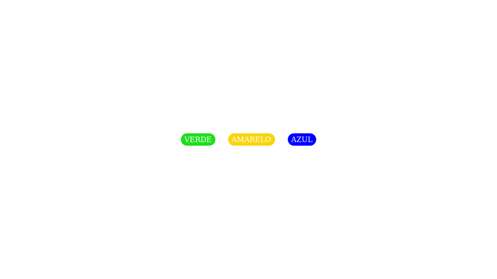

<h1 align="center">
App que mudar cor do fundo de tela!
</h1>

<h4 align="center"> 
	🚧 Projeto 🚀 Em construção...  🚧
</h4>

A cada botão selecionado o background muda de cor

<h1 align="center">
Tecnologias usadas
</h1>

 

Em javascript usei poucas funções para determinar cada ação!

Cada cor foi determinada no Css
 

<h1 align="center">It is with great pride that my small project is on display to the public. Enjoy it👾👨‍💻</h1>
